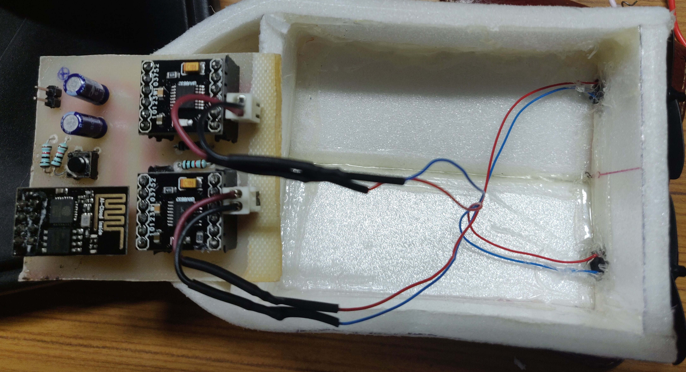
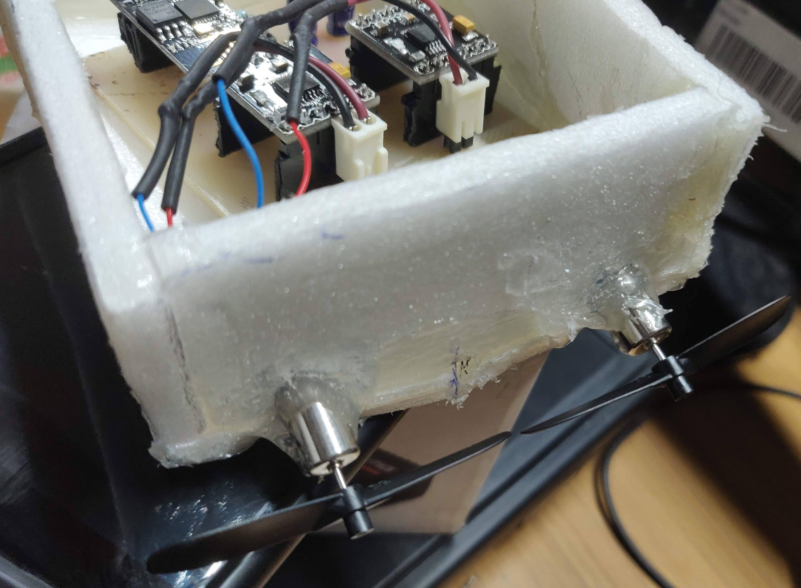

# WiFi controlled RC Boat using ESP8266 NonOS SDK

Native c code for twin motor powered RC boat based on NonOS SDK provided from Espressif.
Control signals are received from remote control android app "Universal RC transmitter".
ESP8266 is set in station mode and connects to access point ID "FreePackets" with password "12345678".
Make changes in a code for changing AP ID and password. 
ESP8266 hosts a TCP IP server. Send data over TCP IP to ESP8266 IP with port no 1112. Sequence of signal to be sent is mentioned in a code.
Boat will stop moving if it goes out off range. Set appropriate seq of signal with required default value in app.

#RC Boat Embedded System

#RC Boat

# Compile
Use method mentioned in [ESP 8266 Getting Started Guide](https://www.espressif.com/sites/default/files/documentation/2a-esp8266-sdk_getting_started_guide_en.pdf) for compiling the code and flashing.

* For ESP8266 (ESP-01 : 1 MB Flash) follow following procedure in the terminal

Go in the folder of the project (here WIFI_RC2) where "ls" cmd will show 
gen_misc.bat  gen_misc.sh  include  Makefile  user
Type command
`./gen_misc.sh`

* choose an appropriate setting for compiling and creating binary files.

`esp8266@esp8266-VirtualBox:~/Share/ESP8266_NONOS_SDK-3.0/sw_timer_test$ ./gen_misc.sh
gen_misc.sh version 20150511

Please follow below steps(1-5) to generate specific bin(s):
STEP 1: choose boot version(0=boot_v1.1, 1=boot_v1.2+, 2=none)
enter(0/1/2, default 2):
2   
boot mode: none

STEP 2: choose bin generate(0=eagle.flash.bin+eagle.irom0text.bin, 1=user1.bin, 2=user2.bin)
enter (0/1/2, default 0):
0
generate bin: eagle.flash.bin+eagle.irom0text.bin

STEP 3: choose spi speed(0=20MHz, 1=26.7MHz, 2=40MHz, 3=80MHz)
enter (0/1/2/3, default 2):
2
spi speed: 40 MHz

STEP 4: choose spi mode(0=QIO, 1=QOUT, 2=DIO, 3=DOUT)
enter (0/1/2/3, default 0):
2
spi mode: DIO

STEP 5: choose spi size and map
    0= 512KB( 256KB+ 256KB)
    2=1024KB( 512KB+ 512KB)
    3=2048KB( 512KB+ 512KB)
    4=4096KB( 512KB+ 512KB)
    5=2048KB(1024KB+1024KB)
    6=4096KB(1024KB+1024KB)
    7=4096KB(2048KB+2048KB) not support ,just for compatible with nodeMCU board
    8=8192KB(1024KB+1024KB)
    9=16384KB(1024KB+1024KB)
enter (0/2/3/4/5/6/7/8/9, default 0):
4
spi size: 4096KB
spi ota map:  512KB + 512KB

start...`
# Flash
Setting for flashing ESP-01 1 MB module

# Support Policy for ESP8266 NonOS

Starting from December 2019, 

* We will not add any new features to the ESP8266 NonOS SDK.
* We will only fix critical bugs in the ESP8266 NonOS SDK.
* We will only maintain the master branch of ESP8266 NonOS SDK, which is a continuously bug-fix version based on v3.0. This means:
	* All other released branches will not be updated.
	* All the future versions will be released from only the master branch mentioned above.
* It is suggested that the [ESP8266_RTOS_SDK](https://github.com/espressif/ESP8266_RTOS_SDK), instead of ESP8266 NonOS SDK, be used for your projects.

The latest ESP8266_RTOS_SDK allows users to develop applications using an architecture that are compatible with the SDKs of all Espressif chips, including ESP8266 series, ESP32 series, and the upcoming new series of chips. Switching to ESP8266_RTOS_SDK will helps users to:

* Eliminate the necessity to maintain more than one applications (for different chips), thus greatly reducing maintenance costs.
* Easily switch to other Espressif chips in the future for enhanced flexibility, less dependency, and reduced time-to-market.

Thank you for your interest in Espressif products.

# ESP8266 NonOS 支持政策

自 2019 年 12 月起，我们将：

* 停止为 ESP8266 NonOS 新增任何功能。
* 仅修复 ESP8266 NonOS 的关键 bug。
* 所有更新仅在 master 分支进行，即基于 v3.0.0 的持续 bug 修复版本。这意味着：
	* 其他任何 release 分支均不再提供维护；
	* 所有更新均将通过上述 master 分支发布。
* 建议客户使用新版 [ESP8266_RTOS_SDK](https://github.com/espressif/ESP8266_RTOS_SDK)。

简单来说，新版 ESP8266_RTOS_SDK 可帮助客户避免对单一 SDK 的依赖，允许客户应用程序同时兼容多款乐鑫芯片，包括 ESP8266 系列、ESP32 系列以及未来发布的新产品。使用 ESP8266_RTOS_SDK 允许客户：

* 避免同时维护针对不同芯片的多套应用程序，从而降低维护成本。
* 未来可轻松切换至其他乐鑫芯片，从而提高灵活性、降低对单一芯片的依赖，并缩短上市时间。

感谢大家对乐鑫的支持与关注。

# ESP8266_NONOS_SDK

All documentations @ http://espressif.com/en/support/download/documents?keys=&field_type_tid%5B%5D=14

## Notes ##
Please add `user_pre_init()` in your project, which will be called before `user_init()`. And you MUST call `system_partition_table_regist()` in `user_pre_init` to register your project partition table.  

The following partition address CAN NOT be modified, and you MUST give the correct address. They are retated to the flash map, please refer to [ESP8266 SDK Getting Started Guide](https://www.espressif.com/sites/default/files/documentation/2a-esp8266-sdk_getting_started_guide_en.pdf) or [ESP8266 SDK 入门指南](https://www.espressif.com/sites/default/files/documentation/2a-esp8266-sdk_getting_started_guide_cn.pdf).  
  
- SYSTEM\_PARTITION\_BOOTLOADER  
- SYSTEM\_PARTITION\_OTA_1  
- SYSTEM\_PARTITION\_OTA_2  
- SYSTEM\_PARTITION\_SYSTEM_PARAMETER  

If you donot use Non-FOTA bin, eagle.irom0.text.bin and irom0.text MUST be downloaded the fixed address, which also can be found in [ESP8266 SDK Getting Started Guide](https://www.espressif.com/sites/default/files/documentation/2a-esp8266-sdk_getting_started_guide_en.pdf) or [ESP8266 SDK 入门指南](https://www.espressif.com/sites/default/files/documentation/2a-esp8266-sdk_getting_started_guide_cn.pdf), and you can define their partition type after `SYSTEM_PARTITION_CUSTOMER_BEGIN`.
